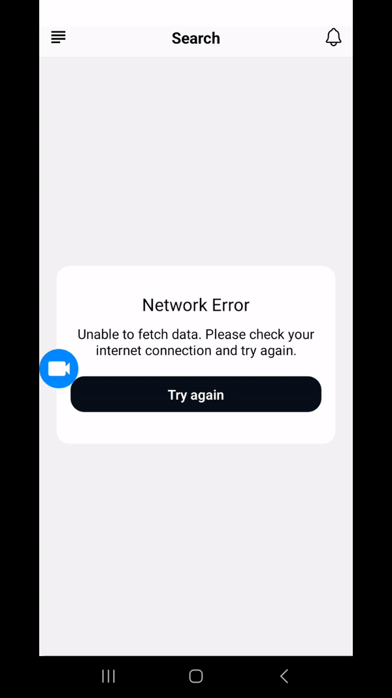

# Mini Project: Data Fetching Mobile Application

<p align="center">
  
  
  
</p>

## API Integration

- **Rick and Morty API (for character data)**:
  - **Endpoint**: `/character` - Fetches a list of characters.

## Features

- **Data Listing**:

  - Fetch and display a list of items from the chosen public API.

- **Search Functionality**:

  - Implement a search bar to filter the list based on user input.

- **Detail View**:

  - Allow users to tap on an item in the list to view detailed information about it.

- **UI/UX**:

  - Design a clean, intuitive interface that is responsive across different devices.
  - Use appropriate visuals and design patterns to enhance user experience.

- **Error Handling**:
  - Handle API errors gracefully by allowing users to retry fetching data. If data fails to load, users will be presented with a retry option to attempt fetching the data again.

## Setup and Installation

To set up and run the project locally, follow these steps:

1. **Clone the Repository**

   ```bash
   git clone https://github.com/amalikmuhd/mini-project.git
   ```

2. **Navigate to Project Directory**

```bash
cd mini-project
```

3. **Install Dependencies**

```bash
npm install
```

4. **Start the Expo Development Server**

```bash
npm start
```

5. **Scan barcode to open the app on your mobile phone**

```bash
Make sure you have ExpoGo download on your phone
```

## Folder Structure

Here is an overview of the project's folder structure:

```plaintext
├── app/                   Screen components for different views
│   ├── _layout/              Entry point of the application
│   └── index/                Index screen
│   └── detail/               Detail screen
|
├── assets/                   Static assets like images and icons
│   ├── images/               Image files used in the app
│   └── icons/                Icon files used in the app
|
├── components/               Reusable React components
│   ├── Header.tsx            Header component
│   ├── ItemList.tsx          ItemList component
│   └── Modal.tsx             Modal component
|   └── SearchBar.tsx         SearchBar component
|   └── ViewAnimation.tsx     ViewAnimation component
|
├── constants/            Constant values like colors and dimensions
│   ├── Colors.ts             Color constants
├── services/                 API service and utility functions
│   ├── apiClient.ts          API configurations
│   └── endpoint.ts           Endpoint
|
├── utils/                  utils folder
│   └── index.ts              date format
|
├── app.json                Expo configuration file
├── package.json            Project dependencies and scripts
├── README.md               This file
```

## Usage

Once the app is running, you can:

- **View Data**: The home screen will display lists fetched from the Rick and Morty API.
- **Search**: Use the search bar to filter through the data.
- **View Details**: Tap on any item to see detailed information.

## Contribution

Feel free to open issues or submit pull requests if you have any improvements or fixes.
